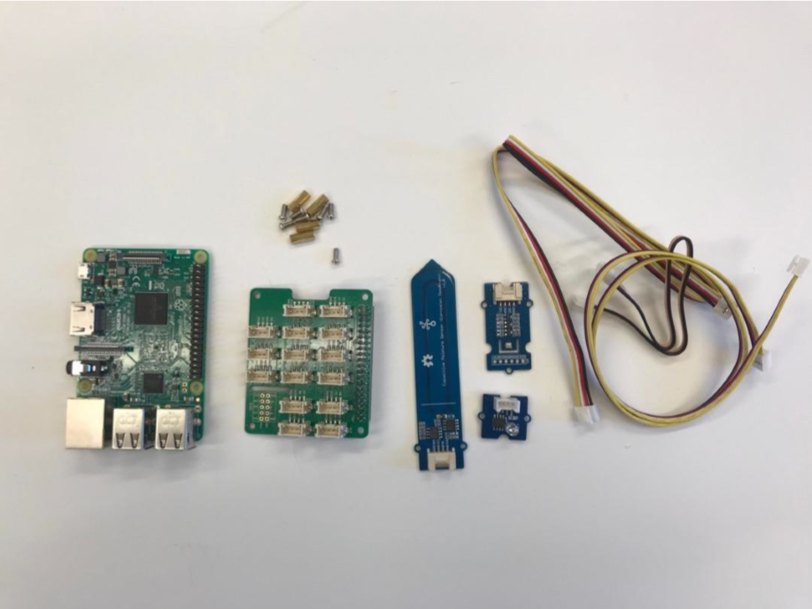
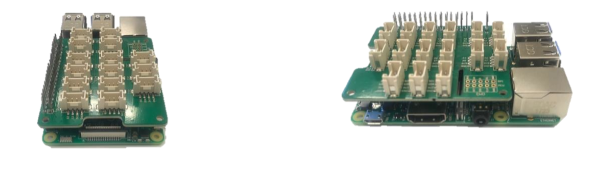
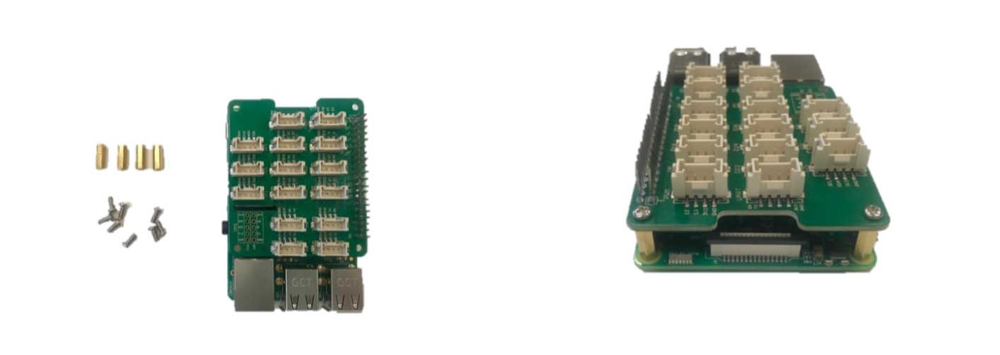
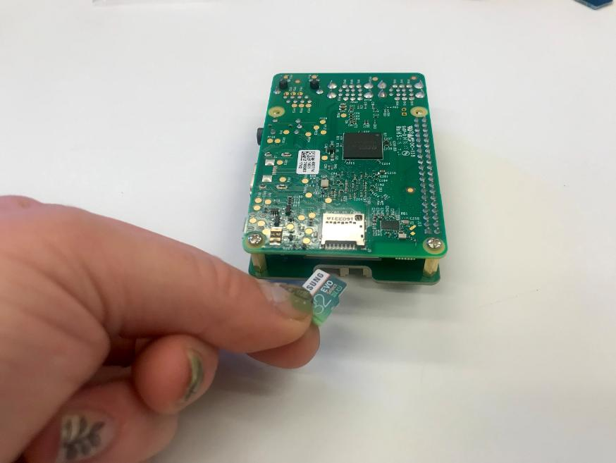
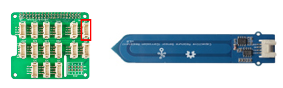
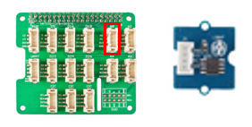
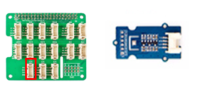
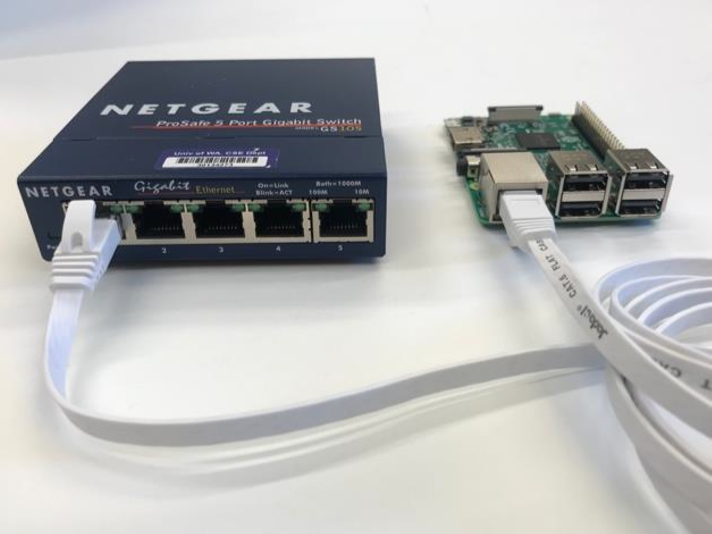

Build your Windows 10 IoT Core Sensor Device
============================================

This lab document is to help with the FarmBeats Lab Kit device
setup.

To complete the installation you will require:

-   A complete FarmBeats Lab Kit with Raspberry Pi and Sensors

-   A pre-installed SD card

-   An internet connection (wired preferred)

-   A small Philips head screwdriver

-   A mouse, keyboard and HDMI monitor is only required for troubleshooting

Assemble your FarmBeats Student Kit Hardware
----------------------------------

The FarmBeats Student Kit has been sent in parts and needs to be assembled
before you can connect it to the internet or install the sensor software.

Preparation
-----------

-   Gather the Raspberry Pi, sensors, sensor cable connecters, the Grove Base
    Hat and small bag of screws from the kit.

-   You will also need a small screwdriver that fits the screws.

Assembling your Student Kit
---------------------------

-   Add the Grove Base Hat to your Raspberry Pi. Match the end pins up and press
    down firmly. Look at it from all angles to ensure that it is correctly
    connected.

-   Screw in the supports on the side opposite the pins to stop the other side
    of the Grove Base Hat from collapsing onto the Raspberry Pi. This requires a
    small screwdriver.

-   Insert the SD card into the Raspberry Pi slot on the underneath.

-   Plug the Capacitive Soil Moisture Sensor into socket A2. If you have a
    second one plug it into A4.

-   Plug the Light Sensor into socket A0.

-   Plug the Temperature, Humidity and Barometer Sensor (BME280) into the bottom
    left I2C socket.

-   Once all your sensors are plugged in you should have something that looks
    like this.

Next Steps
----------

You have now assembled your FarmBeats Student Kit. You can now proceed to [Step
1c – Identify your unique Device
ID](https://github.com/farmbeatslabs/fblkv2/blob/master/Indoor-m1/1c_Identify_your_unique_Device_ID.md)

Connecting to the Internet
--------------------------

There are multiple options to getting your Raspberry Pi online. It’s essential to have your Raspberry Pi and PC connected to the same network.

*Note: Internet connectivity and device to device communication is the area that
often requires the most troubleshooting. See Known Issues and Frequently Asked
Questions if you are having issues getting your device online.*

-   **To connect with an Ethernet Cable** – Plug one side of the LAN cable into
    the Raspberry Pi and the other into the same Ethernet Hub or Switch that
    your PC is plugged into.

-   **To connect with a Wi-Fi connection** – plug mouse, keyboard and monitor into your device and then connect to wifi the first time. From then on it will connect automatically. 

Next you can move to - [Step 2 - Registering your FarmBeats Student Kit User and Device](https://github.com/farmbeatslabs/FBLKv2/blob/master/Indoor-m1/2_Register_your_FarmBeats_Student_Kit_User_and_Device.md) 
 
