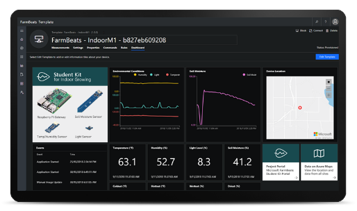

Microsoft FarmBeats Lab Kit: Indoor M1
==========================================

The FarmBeats Lab Kit - Indoor M1, includes preconfigured Microsoft Azure
cloud services, and a Raspberry Pi with Windows 10 IoT Core along with soil
moisture, light, air temperature, humidity and barometric pressure sensors to
collect data that can provide insights to help you understand how to improve
productivity, increase yield, and save resources.

What are the components that make up the kit
--------------------------------------------

The FarmBeats Student Kit Indoor M1 is an Internet of Things (IoT) solution that
is made up of several technology components that include the cloud and the
device.

**Windows 10 IoT Core operating system**

Windows 10 IoT Core is the smallest member of the Windows 10 family that brings
power, security and manageability to the Internet of Things (IoT). It allows
individuals and organizations to create secure devices that can be quickly
provisioned, easily managed, and seamlessly connected to the cloud.

**Grove system and sensors**

Grove is an electronics system that simplifies connections to hundreds of
different sensors, so you can program them to monitor, control, and automate
devices. Sensors included in the kit: soil moisture, light, air temperature and
humidity.

**Azure IoT Central cloud service**

Azure IoT Central is a fully managed Internet of Things (IoT)
Software-as-a-Service (SaaS) solution that makes it easy to create products that
connect the physical and digital worlds, monitor, and manage your IoT devices.

**Azure Maps geospatial data browsing**

Add maps, search, routing, and traffic capabilities to your apps with geospatial
services APIs that integrate seamlessly with other Azure tools and services.

Setting up your FarmBeats Student Kit
-------------------------------------

To get started follow these instructions:

-   1 - [Build and test your Windows 10 IoT Core
    device](https://github.com/farmbeatslabs/fblkv2/blob/master/Indoor-m1/1_Build_your_Windows_10_IoT_Core_Device.md)

    -   Attach sensors, and connect your device.

-   2 - [Register your FarmBeats Student Kit User and
    Devices](https://github.com/farmbeatslabs/fblkv2/blob/master/Indoor-m1/2_Register_your_FarmBeats_Lab_Kit_User_and_Device.md)

    -   Sign up at the FarmBeats Student Kit Portal and register your device.

-   3 - [Configure your Azure IoT Central Cloud
    Services](https://github.com/farmbeatslabs/fblkv2/blob/master/Indoor-m1/3_Configure_your_Azure_IoT_Central_Cloud_Service.md)

    -   Customize your Azure IoT Central to gain insights from sensor data.

Whats in the FarmBeats Lab Kit
---------------------------------------

At this time we are only supplying the FarmBeats Lab Kit customized and
pre-configured for educational institutions like schools, universities and code
clubs. 

If you would like to purchase kits then please contact us by email at
[mailto:support\@farmbeatslabs.com](mailto:support@farmbeatslabs.com).

Whats in the kit
-----------------
[FarmBeats Student Kit: Indoor M1 Hardware
List](https://github.com/farmbeatslabs/fblkv2/blob/master/Indoor-m1/Indoor_M1_Hardware_List.md)

